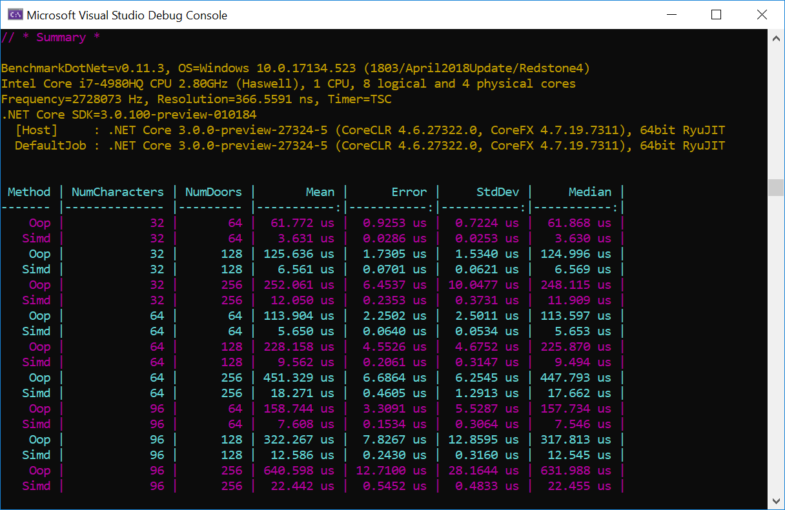
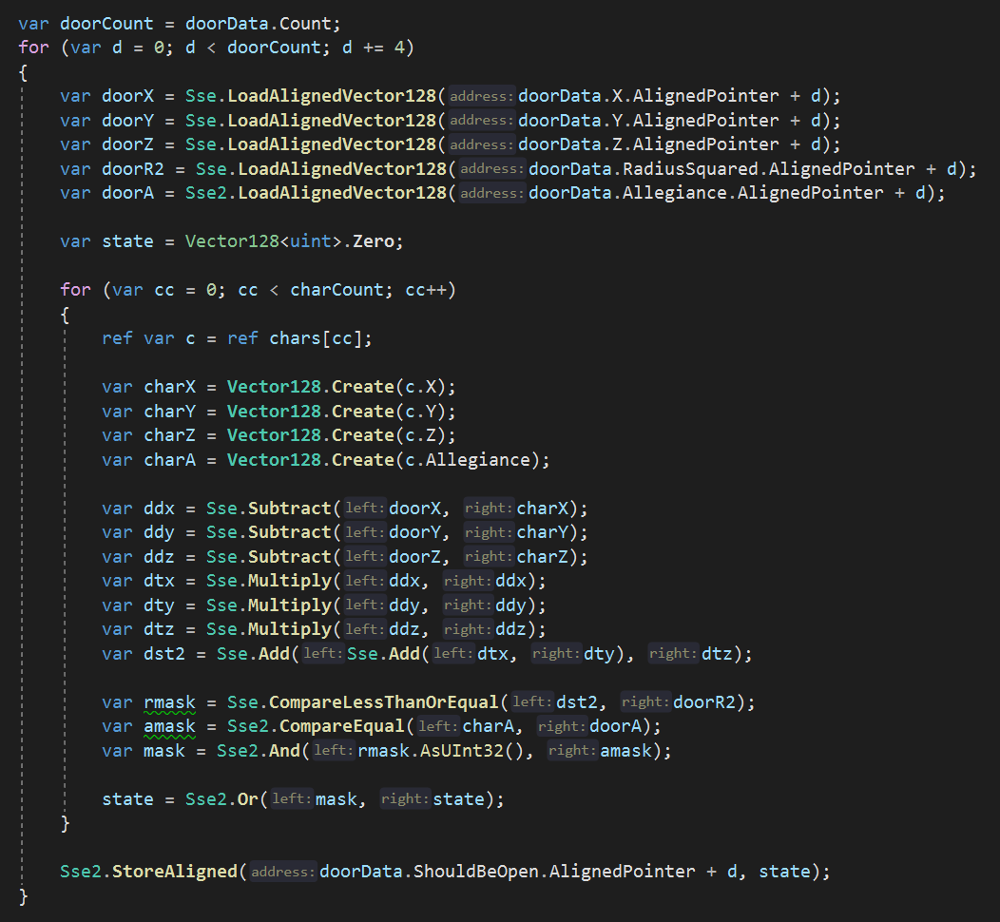

# SimdDoors

This is an example project showing how to use the new SIMD intrinsics in .NET Core 3.0.

It includes both OOP and SIMD implementations of a somewhat real-world example 
involving doors and characters. The example problem is from Andreas Frederiksson's
[SIMD at Insomniac Games](https://deplinenoise.files.wordpress.com/2015/03/gdc2015_afredriksson_simd.pdf) 
GDC presentation.

Here's the interesting bit of the SIMD code:

## License

This code is released under the MIT license.

## Author

[Tim Jones](http://timjones.io)